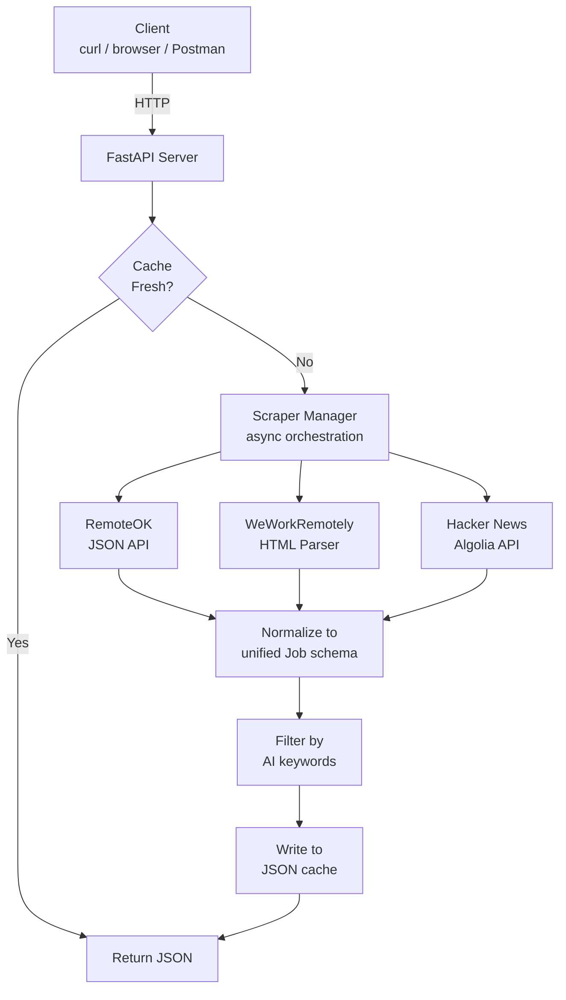

# AIJobRadar

> Production-grade REST API that aggregates real-time AI/ML job listings from RemoteOK, WeWorkRemotely, and Hacker News — unified in a single endpoint.

[](https://www.python.org/downloads/)
[](https://fastapi.tiangolo.com)
[](#testing)
[](#testing)
[](https://github.com/stefanpesovic/AIJobRadar/actions/workflows/ci.yml)
[](LICENSE)

<!-- [LIVE_DEMO_URL] — replace with Render deployment URL -->


---

## Why I Built This

AI/ML job hunting is broken:

1. **Listings are scattered** — RemoteOK, WeWorkRemotely, Hacker News "Who is hiring?", and dozens of other boards each have a fraction of the market. There's no single source of truth.
2. **Formats are inconsistent** — One site returns JSON, another requires HTML scraping, another needs you to parse free-text comment threads. Comparing listings across sources is manual and tedious.
3. **Filtering is weak** — Most job boards don't let you filter specifically for AI/ML roles. You end up scrolling through hundreds of irrelevant listings.

**AIJobRadar** solves all three: it scrapes multiple sources concurrently, normalizes everything into a unified schema, filters by 23 AI/ML keywords, and serves the results through a clean REST API with pagination and search.

*Built as part of the [5-Day AI Dev Challenge](https://github.com/stefanpesovic) — from zero to deployed in 5 days.*

## Architecture



## Features

- **Multi-source aggregation** — Scrapes RemoteOK, WeWorkRemotely, and Hacker News concurrently
- **AI/ML keyword filtering** — 23 configurable keywords (LLM, PyTorch, MLOps, RAG, computer vision, etc.)
- **Unified schema** — Every job normalized into the same Pydantic model regardless of source
- **Smart caching** — JSON file cache with configurable TTL avoids hammering source sites
- **Filterable API** — Search by keyword, company, location, or source with pagination
- **Graceful degradation** — One scraper failing doesn't take down the API
- **Auto-generated docs** — Interactive Swagger UI at `/docs`
- **Fully tested** — 66 tests with 89% code coverage

## Tech Stack

| Component     | Choice                          |
|---------------|---------------------------------|
| Language      | Python 3.11+                    |
| Web framework | FastAPI                         |
| HTTP client   | httpx (async)                   |
| HTML parsing  | BeautifulSoup4 + lxml           |
| Validation    | Pydantic v2                     |
| Config        | pydantic-settings + .env        |
| Testing       | pytest + pytest-asyncio + respx |
| Server        | uvicorn                         |
| Linting       | ruff                            |
| Formatting    | black                           |

## Quickstart

```bash
# Clone the repository
git clone https://github.com/stefanpesovic/AIJobRadar.git
cd AIJobRadar

# Create and activate a virtual environment (Python 3.11+)
python3 -m venv venv
source venv/bin/activate

# Install dependencies
pip install -r requirements.txt

# (Optional) Copy and configure environment variables
cp .env.example .env

# Start the server
python run.py
```

The API will be available at **http://localhost:8000**.

## API Endpoints

### `GET /` — Welcome

Returns navigation links to all endpoints.

### `GET /jobs` — List AI/ML Jobs

Returns paginated, filterable job listings.

**Query Parameters:**

| Param      | Type   | Default | Description                              |
|------------|--------|---------|------------------------------------------|
| `keyword`  | string | —       | Filter by keyword (title/company/tags)   |
| `company`  | string | —       | Filter by company name                   |
| `location` | string | —       | Filter by location                       |
| `source`   | string | —       | Filter by source (remoteok/weworkremotely/hackernews) |
| `page`     | int    | 1       | Page number                              |
| `limit`    | int    | 20      | Results per page (max 100)               |

All filters are case-insensitive substring matches.

**Example:**

```bash
curl "http://localhost:8000/jobs?source=weworkremotely&limit=1"
```

```json
{
  "total": 43,
  "page": 1,
  "limit": 1,
  "jobs": [
    {
      "id": "weworkremotely_vanta-senior-software-engineer-ai-product",
      "title": "Senior Software Engineer, AI Product",
      "company": "Vanta",
      "location": "San Francisco, US",
      "salary": null,
      "tags": ["Full-Time", "Anywhere in the World"],
      "url": "https://weworkremotely.com/remote-jobs/vanta-senior-software-engineer-ai-product",
      "source": "weworkremotely",
      "posted_at": null,
      "scraped_at": "2026-04-22T12:28:26.809833Z"
    }
  ]
}
```

### `GET /sources` — Source Status

Returns scrape time, job count, and error status for each source.

```bash
curl http://localhost:8000/sources
```

### `POST /refresh` — Force Re-scrape

Invalidates cache and re-scrapes all sources. Returns stats and duration.

```bash
curl -X POST http://localhost:8000/refresh
```

### `GET /health` — Health Check

```bash
curl http://localhost:8000/health
# {"status": "ok", "version": "1.0.0"}
```

### Swagger UI

Interactive documentation is available at **http://localhost:8000/docs**.

## Docker

```bash
# Build the image
docker build -t aijobradar .

# Run the container
docker run -p 8000:8000 aijobradar

# Access the API
curl http://localhost:8000/jobs?limit=5
```

## Engineering Decisions & Trade-offs

- **JSON file cache over SQLite** — For a single-instance service with ephemeral scraped data, a flat JSON file with TTL is simpler to deploy and debug — no migrations, no ORM, and the cache is human-readable. For a production multi-instance deployment, this would be swapped for Redis.
- **Async scraping with httpx** — All three scrapers run concurrently via `asyncio.gather()` in the `ScraperManager`, so total scrape time equals the slowest source (~2-3s) instead of the sum of all three (~6-9s sequential).
- **Abstract BaseScraper pattern** — Each source implements a `scrape() -> list[Job]` interface. Adding a new source (e.g., LinkedIn, Indeed) means adding one file with zero changes to the orchestration layer or API routes.
- **Graceful degradation** — Each scraper catches its own exceptions and returns `[]` on failure. If RemoteOK goes down, WeWorkRemotely and Hacker News results still serve normally — one broken source never crashes the API.
- **Keyword filter in config, not code** — The 23 AI/ML keywords live in `Settings.AI_KEYWORDS` (loaded via pydantic-settings), which can be overridden via environment variable without touching code or redeploying.

## Project Structure

```
aijobradar/
├── app/
│   ├── __init__.py
│   ├── main.py              # FastAPI app entry point
│   ├── config.py            # Settings via pydantic-settings
│   ├── models.py            # Pydantic data models
│   ├── cache.py             # JSON file cache with TTL
│   ├── routes/
│   │   ├── __init__.py
│   │   └── jobs.py          # API route handlers
│   └── scrapers/
│       ├── __init__.py
│       ├── base.py           # Abstract base scraper
│       ├── manager.py        # Scraper orchestration
│       ├── remoteok.py       # RemoteOK (JSON API + HTML fallback)
│       ├── weworkremotely.py # WeWorkRemotely (HTML scraper)
│       └── hackernews.py     # HN "Who is hiring?" (Algolia API)
├── tests/
│   ├── __init__.py
│   ├── conftest.py           # Shared fixtures
│   ├── test_api.py           # API endpoint tests
│   ├── test_cache.py         # Cache layer tests
│   ├── test_scrapers.py      # Scraper tests with mocked HTTP
│   └── fixtures/             # Sample HTML/JSON for tests
├── data/                     # Cache directory
├── docs/                     # Demo media (GIF, screenshots)
├── .github/workflows/ci.yml  # GitHub Actions CI
├── .env.example
├── .gitignore
├── requirements.txt
├── pyproject.toml
├── Dockerfile
├── .dockerignore
├── CHANGELOG.md
├── run.py
├── LICENSE
└── README.md
```

## Testing

```bash
# Run the full test suite
pytest

# Run with coverage report
pytest --cov=app --cov-report=term-missing

# Run a specific test file
pytest tests/test_api.py -v
```

## Linting & Formatting

```bash
# Check for lint errors
ruff check app/ tests/

# Check formatting
black --check app/ tests/

# Auto-fix formatting
black app/ tests/
```

## Configuration

All settings can be overridden via environment variables or a `.env` file. See `.env.example` for the full list.

| Variable                 | Default                | Description                      |
|--------------------------|------------------------|----------------------------------|
| `CACHE_TTL_MINUTES`      | `60`                   | Cache freshness duration         |
| `REQUEST_TIMEOUT_SECONDS` | `15`                  | HTTP request timeout             |
| `MAX_JOBS_PER_SOURCE`    | `100`                  | Max jobs returned per scraper    |
| `LOG_LEVEL`              | `INFO`                 | Logging level                    |
| `CACHE_FILE_PATH`        | `data/jobs_cache.json` | Path to the cache file           |
| `USER_AGENT`             | `Mozilla/5.0 (AIJobRadar/1.0; ...)` | HTTP User-Agent header |

## Data Sources

| Source           | Method                    | Notes                                          |
|------------------|---------------------------|-------------------------------------------------|
| RemoteOK         | JSON API (`/api`)         | Falls back to HTML parsing if API fails         |
| WeWorkRemotely   | HTML scraping             | Category page fallback if search is blocked     |
| Hacker News      | Algolia API               | Parses latest "Who is hiring?" thread comments  |

## Roadmap

- **Database backend** — Migrate from JSON file cache to PostgreSQL or SQLite for persistent storage and richer queries
- **Notifications** — Email or Slack alerts when new jobs match custom keyword profiles
- **More sources** — Add LinkedIn, Indeed, and Glassdoor scrapers using the existing `BaseScraper` interface
- **Dashboard UI** — React or HTMX frontend for browsing and bookmarking jobs

## Author

**Stefan Pesovic** — [GitHub](https://github.com/stefanpesovic)

Built as part of the **5-Day AI Dev Challenge**.

## License

[MIT](LICENSE)
